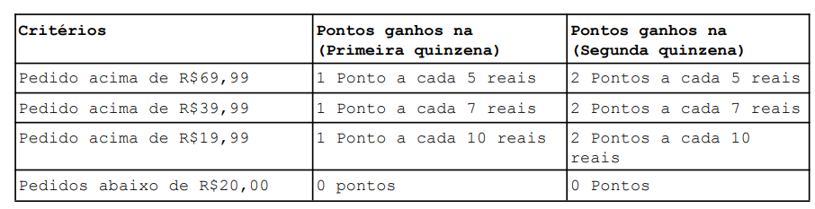

**O dono
percebeu que o faturamento da hamburgueria cai consideravelmente na
segunda quinzena dos meses. Visando resolver esse problema, ele deseja que
do dia 16 até o último dia do mês os pontos ganhos pelos cliente sejam o
dobro do que ganhavam na primeira quinzena.
Foram estabelecidos critérios de pontuação para determinar quantos
pontos um pedido dá a um cliente no programa de fidelização**:

